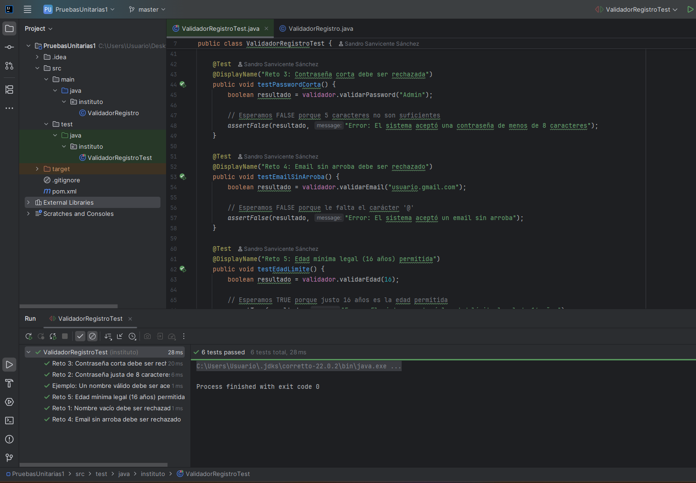

# Práctica: Pruebas Unitarias con JUnit (Validador de Registro)

##  Descripción del Proyecto
Este proyecto es una práctica de introducción a las pruebas unitarias (Testing) en Java. El objetivo principal ha sido desarrollar un conjunto de pruebas automáticas utilizando la librería **JUnit 5** para verificar el correcto funcionamiento de una clase que valida los datos de registro de un usuario.

##  Tecnologías Utilizadas
* **Lenguaje:** Java
* **Framework de Pruebas:** JUnit 5
* **Gestor de Dependencias:** Maven
* **IDE:** IntelliJ IDEA

##  Lo que he desarrollado
He trabajado principalmente sobre dos archivos:

1. `ValidadorRegistro.java`: Contiene la lógica de negocio. Es el "motor" que valida nombres, contraseñas, correos electrónicos y edades.
2. `ValidadorRegistroTest.java`: Contiene los tests unitarios.

Se han superado con éxito **5 retos** comprobando los siguientes casos límite mediante aserciones (`assertTrue` y `assertFalse`):

* **Reto 1 (Nombre vacío):** Se verificó que el sistema bloquea los nombres en blanco.
* **Reto 2 (Contraseña justa):** Se verificó que el sistema acepta contraseñas de exactamente 8 caracteres.
* **Reto 3 (Contraseña corta):** Se verificó que el sistema bloquea contraseñas de menos de 8 caracteres (ej. 5 letras).
* **Reto 4 (Email sin arroba):** Se verificó que el sistema rechaza correos con formato inválido.
* **Reto 5 (Edad límite):** Se verificó que el sistema permite el registro a usuarios con la edad mínima legal exacta (16 años).

##  Cómo ejecutar las pruebas
1. Abre el proyecto en IntelliJ IDEA.
2. Asegúrate de haber sincronizado el proyecto con Maven.
3. Navega hasta `src/test/java/instituto/ValidadorRegistroTest.java`.
4. Haz clic en el botón de **Play (Run)** junto a la declaración de la clase.
5. Comprueba en la consola que todos los tests se ejecutan correctamente (Checks verdes ✅).

